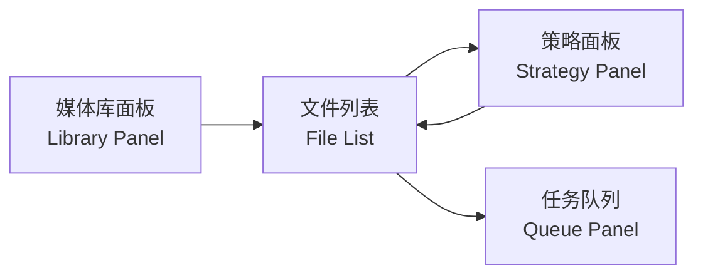
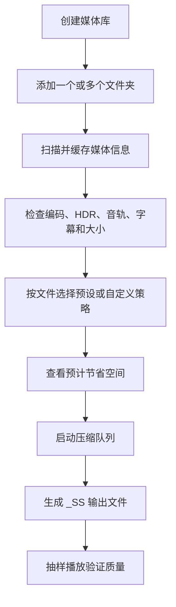
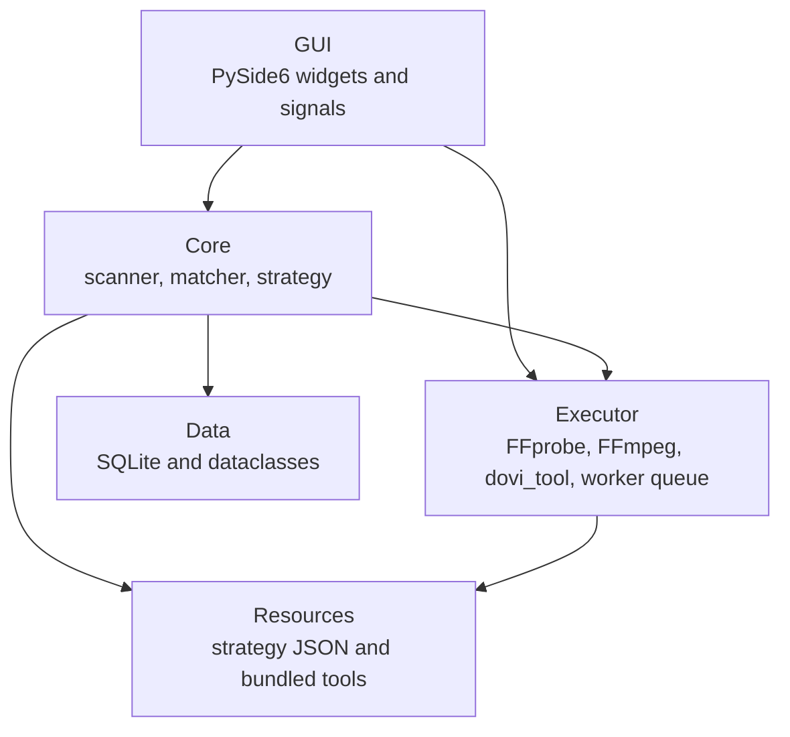

<div align="center">

# LeanReel

**给个人媒体库做“瘦身决策”的桌面工具**

扫描影片目录，识别真实编码与 HDR 信息，按文件选择压缩策略，预估可节省空间，并生成更安全的 FFmpeg 压缩任务。

[](https://www.python.org/)
[](https://doc.qt.io/qtforpython-6/)
[](https://ffmpeg.org/)
[](https://sqlite.org/)

</div>

---

## 目录

- [项目定位](#项目定位)
- [功能亮点](#功能亮点)
- [界面导览](#界面导览)
- [压缩策略](#压缩策略)
- [典型工作流](#典型工作流)
- [快速开始](#快速开始)
- [开发指南](#开发指南)
- [架构说明](#架构说明)
- [数据与安全](#数据与安全)
- [项目状态](#项目状态)
- [路线图](#路线图)

## 项目定位

很多个人媒体库并不是“文件太多”这么简单，而是很难在压缩前做判断：

- 有的文件还是 H.264、MPEG-2 或 VC-1，压缩收益很明显。
- 有的文件已经是 HEVC，继续压缩可能收益很小甚至得不偿失。
- 有的片源带 HDR10 或 Dolby Vision，需要更谨慎地保留元数据。
- 有的文件夹混着正片、评论音轨、外挂字幕、内封字幕和章节信息。
- 手动逐个用命令行检查 FFprobe 输出很慢，也很容易漏掉关键条件。

LeanReel 的目标不是替你盲目“一键压缩所有视频”，而是先把媒体库里的关键信息摆出来，让你能更快决定：哪些值得压、用什么策略压、预计能省多少空间，以及输出是否足够安全。

## 功能亮点

| 能力 | 当前表现 |
| --- | --- |
| 媒体库管理 | 支持创建多个媒体库，并为每个媒体库挂载多个文件夹。 |
| 文件扫描 | 递归扫描视频文件，生成可复用的 SQLite 缓存。 |
| 编码识别 | 通过 FFprobe 识别视频编码、分辨率、时长、码率、音轨、字幕、HDR 类型。 |
| 缓存修复 | 旧缓存缺少编码、宽高等关键字段时，会重新探测而不是继续展示空信息。 |
| 并发探测 | 对未缓存或失效文件并发调用 FFprobe，加快小文件夹和大目录的初次加载。 |
| 列表展示 | 文件列表展示大小、编码、HDR、策略、预计节省空间等核心字段。 |
| 手动排序 | 表格字段支持排序，大小和节省空间按数值排序。 |
| 手动列宽 | 列表表头可拖拽调整宽度，避免策略下拉文字挤压重合。 |
| 双视图模式 | 支持“平铺”和“目录树”两种浏览模式。 |
| 策略预设 | 内置 CPU、GPU 和仅去冗余等多类策略。 |
| 单文件策略 | 可以在文件列表中给单个文件手动选择压缩策略。 |
| 自定义策略 | 选择“自定义”后，右侧面板切换到参数编辑区。 |
| 实时估算 | 调整自定义 CRF / CQ / 编码器后，预计节省空间会实时刷新。 |
| 安全输出 | 默认生成 `_SS` 后缀输出文件，避免直接覆盖原始媒体。 |
| 打包支持 | 提供 PyInstaller 配置，仓库内包含 Windows 版 FFmpeg / FFprobe / dovi_tool。 |

## 界面导览

LeanReel 的主窗口不是向导式流程，而是一个面向批量决策的工作台。



### 媒体库面板

左侧用于管理媒体库和文件夹。你可以按自己的收藏方式拆分，例如：

| 媒体库 | 适合内容 |
| --- | --- |
| Film | 电影、蓝光 Remux、WEB-DL |
| TV | 剧集、季度目录 |
| Anime | 动画、番剧、外挂字幕较多的目录 |
| Documentary | 纪录片、长片、系列专题 |
| NAS Movies | 挂载在 NAS 或外置盘上的媒体 |

一个媒体库可以包含多个文件夹，适合把本地磁盘和挂载盘归到同一个逻辑集合下。

### 文件列表

文件列表是最重要的决策区。它会显示：

- 文件名和相对路径
- 文件大小
- 当前视频编码
- HDR / Dolby Vision 分类
- 匹配或手动选择的策略
- 预计可节省空间

表格支持排序和手动列宽。对剧集、季度、子目录结构较深的媒体库，可以切换到目录树模式，按文件夹层级浏览。

### 策略面板

右侧策略面板有两种状态：

| 状态 | 用途 |
| --- | --- |
| 预设策略 | 快速选择均衡、极限、轻量、NVENC 或仅去冗余方案。 |
| 自定义参数 | 给当前选中的单个文件调整编码器、CRF / CQ、预设、音轨和字幕处理方式。 |

当你在文件列表中把某一行策略改为 `自定义`，右侧会自动显示自定义面板。每次修改参数都会重新计算该文件的预计节省空间。

### 任务队列

队列面板负责展示压缩任务的执行状态。当前重点是基础状态呈现和队列执行链路；暂停、取消、重试、历史记录和更完整的结果统计仍在打磨中。

## 压缩策略

策略以 JSON 文件存放在 `leanreel/resources/strategies/`，方便阅读和扩展。

| 策略 | 编码方向 | 预计节省 | 适合场景 |
| --- | --- | --- | --- |
| 均衡压缩 | CPU HEVC | 35-50% | 大多数 H.264 或 Remux 文件，兼顾画质和体积。 |
| 极限压缩 | CPU HEVC | 50-70% | 空间压力很大，愿意接受更激进压缩。 |
| 轻量压缩 | CPU HEVC | 20-35% | 收藏级片源、HDR 内容或想尽量保守的文件。 |
| 仅去冗余 | 视频流 copy | 5-15% | 不想重编码视频，只想整理音轨、字幕或冗余流。 |
| NVENC 均衡压缩 | GPU HEVC | 35-50% | 有 NVIDIA 显卡，希望用硬件编码加速批量处理。 |
| NVENC 高质量 | GPU HEVC | 20-35% | 更偏画质，适合对速度和质量都有要求的片源。 |

自定义策略当前支持这些参数：

| 参数 | 可选值 |
| --- | --- |
| 编码器 | `libx265`、`libx264`、`hevc_nvenc`、`h264_nvenc`、`copy` |
| CPU 质量 | `CRF 0-35` |
| GPU 质量 | `CQ 0-51` |
| CPU 预设 | `medium`、`slow`、`slower`、`fast` |
| NVENC 预设 | `P1` 到 `P7` |
| 音轨 | `keep_original`、`strip_commentary` |
| 字幕 | `keep_chinese`、`keep_chinese_english`、`keep_all`、`remove_all` |

## 典型工作流



建议先用一个小文件夹验证策略，再扩大到完整媒体库。尤其是 HDR / Dolby Vision 内容，不同播放器和显示链路对元数据的处理可能不同，抽样验证很重要。

## 快速开始

### 环境要求

- Windows 是当前主要开发和验证平台。
- Python 3.11 或更高版本。
- 仓库内已经包含 Windows 版 `ffmpeg.exe`、`ffprobe.exe` 和 `dovi_tool.exe`。

### 安装依赖

```bash
py -m pip install -e ".[dev]"
```

如果你的环境直接使用 `python`：

```bash
python -m pip install -e ".[dev]"
```

### 启动应用

```bash
py -m leanreel.main
```

或者：

```bash
python -m leanreel.main
```

### 基本使用

1. 在左侧创建媒体库。
2. 给媒体库添加一个或多个文件夹。
3. 等待扫描完成。
4. 在文件列表里检查编码、HDR 和预计节省空间。
5. 根据需要切换“平铺”或“目录树”视图。
6. 在单个文件行里选择预设策略，或选择 `自定义`。
7. 在右侧调整自定义参数，确认节省空间估算。
8. 点击开始压缩，等待队列执行。

## 开发指南

### 运行测试

```bash
py -m pytest -q
```

### 编译检查

```bash
py -m compileall -q leanreel tests
```

### 构建可执行文件

```bash
py -m PyInstaller build.spec --noconfirm
```

构建产物会输出到 `dist/`，该目录不纳入 Git。

## 架构说明

LeanReel 采用小型分层结构：GUI 负责交互，Core 负责业务决策，Executor 负责外部工具调用，Data 负责持久化。



### 关键模块

| 路径 | 职责 |
| --- | --- |
| `leanreel/main.py` | 应用装配、信号连接、任务创建和主流程协调。 |
| `leanreel/gui/library_panel.py` | 媒体库和文件夹管理。 |
| `leanreel/gui/file_list.py` | 文件列表、目录树、编码展示、策略选择、节省空间展示。 |
| `leanreel/gui/strategy_panel.py` | 预设策略卡片、自定义策略、并行和输出设置。 |
| `leanreel/gui/queue_panel.py` | 编码任务状态展示和部分队列控制入口。 |
| `leanreel/core/scanner.py` | 文件发现、缓存读取、FFprobe 元数据刷新。 |
| `leanreel/core/matcher.py` | 策略匹配和节省空间估算。 |
| `leanreel/core/strategy.py` | 策略数据结构和 JSON 加载。 |
| `leanreel/executor/probe.py` | FFprobe 调用和媒体流解析。 |
| `leanreel/executor/ffmpeg.py` | FFmpeg 命令构建和执行适配。 |
| `leanreel/executor/dovi.py` | Dolby Vision 相关命令辅助，仍偏实验性。 |
| `leanreel/executor/worker.py` | 编码任务、状态和执行队列。 |
| `leanreel/data/database.py` | SQLite schema、媒体快照持久化，以及压缩历史表和数据接口。 |

## 数据与安全

LeanReel 会把扫描结果写入 SQLite，避免每次打开都重新探测完整媒体库。

缓存策略：

- 文件大小和关键元数据有效时，优先复用缓存。
- 缺少编码、宽度或高度等核心字段时，视为旧缓存并重新探测。
- 音轨和字幕轨道以 JSON 形式保存。
- 单个文件探测失败时，会保存最小快照，保证列表仍能展示该文件。

输出策略：

```text
Movie.mkv -> Movie_SS.mkv
```

默认输出路径不会直接覆盖原文件。对大目录执行前，建议先用少量样本验证画质、字幕、音轨和播放器兼容性。

## 项目状态

LeanReel 仍处于早期活跃开发阶段。它已经能作为本地桌面原型使用，但还不是正式发布版。

### 已经可用

- 媒体库和文件夹管理。
- SQLite 持久化。
- FFprobe 元数据提取。
- 编码、HDR、音轨、字幕基础展示。
- 旧缓存关键字段缺失时自动重新探测。
- 文件列表排序和手动列宽。
- 平铺与目录树视图。
- 单文件策略覆盖。
- 自定义压缩参数和实时节省空间估算。
- 基础编码任务构建与队列状态展示。
- 压缩历史数据结构和数据库接口。
- Windows PyInstaller 打包配置。

### 仍在完善

- 更细的暂停、恢复、取消、重试行为和 GUI 接入。
- 更完整的 FFmpeg 进度解析与完成结果统计。
- Dolby Vision Profile 7 的完整端到端验证。
- 更稳健的旧数据库迁移工具。
- 跨平台打包和发布验证。
- 压缩后质量抽检、体积对比和报告导出。
- 对损坏媒体、异常容器和极端字幕流的处理。

## 路线图

| 阶段 | 重点 |
| --- | --- |
| 0.1 | 扫描、缓存、编码识别、策略选择和基础任务链路。 |
| 0.2 | 队列控制、进度解析、取消、重试和完成结果统计。 |
| 0.3 | HDR / Dolby Vision 工作流加固和压缩后验证报告。 |
| 0.4 | 设置页、用户策略编辑器、跨平台构建和发布包。 |
| 0.5 | 更完整的历史记录、批量对比和媒体库健康分析。 |

## 贡献前检查

推荐在提交前运行：

```bash
py -m pytest -q
py -m compileall -q leanreel tests
```

代码变更自查：

- 是否避免了长任务阻塞 GUI 线程？
- 是否保留了“不覆盖原始媒体”的安全默认值？
- 新行为是否有测试覆盖？
- README 是否只描述已经存在或明确标注为路线图的能力？
- 对旧缓存、探测失败、空目录和异常媒体文件是否有退路？

## License

当前仓库尚未添加 LICENSE 文件。在正式选择许可证前，请按 all rights reserved 处理。
