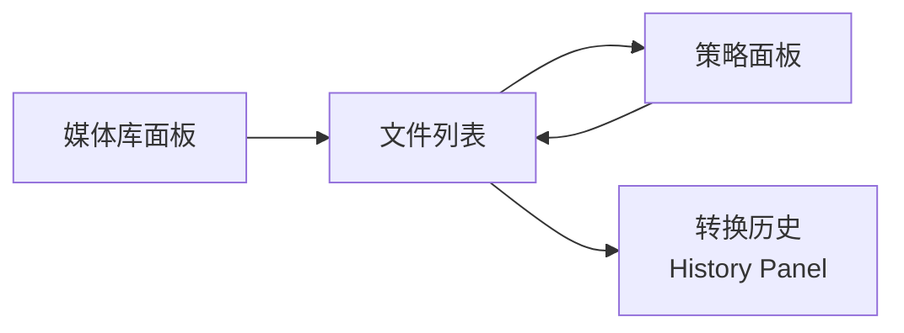
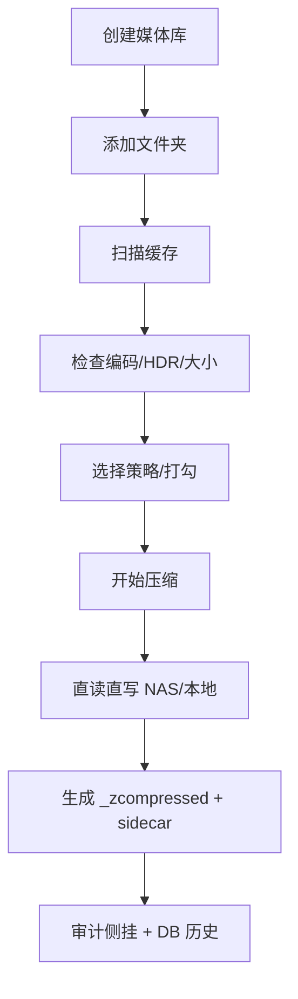
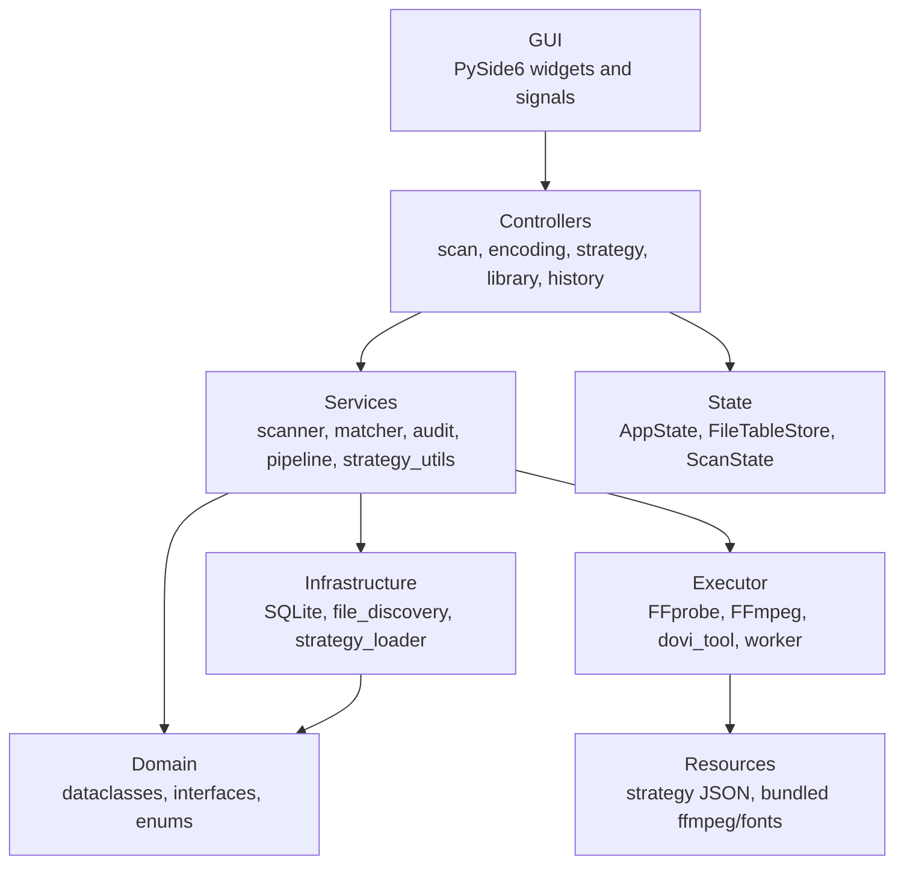

<div align="center">

# LeanReel

**给个人媒体库做"瘦身决策"的桌面工具**

扫描影片目录，识别真实编码与 HDR 信息，按文件选择压缩策略，预估可节省空间，并生成更安全的 FFmpeg 压缩任务。

[](https://www.python.org/)
[](https://doc.qt.io/qtforpython-6/)
[](https://ffmpeg.org/)
[](https://sqlite.org/)

</div>

---

## 目录

- [项目定位](#项目定位)
- [功能亮点](#功能亮点)
- [界面导览](#界面导览)
- [压缩策略](#压缩策略)
- [典型工作流](#典型工作流)
- [快速开始](#快速开始)
- [开发指南](#开发指南)
- [架构说明](#架构说明)
- [数据与安全](#数据与安全)
- [项目状态](#项目状态)

## 项目定位

LeanReel 的目标不是替你盲目"一键压缩所有视频"，而是先把媒体库里的关键信息摆出来，让你能更快决定：哪些值得压、用什么策略压、预计能省多少空间，以及输出是否足够安全。

## 功能亮点

| 能力 | 说明 |
| --- | --- |
| 多库管理 | 创建多个媒体库，每个库挂载多个文件夹（本地/NAS）。 |
| 文件扫描 | 递归扫描视频文件，生成可复用的 SQLite 缓存。 |
| 编码识别 | FFprobe 识别编码、分辨率、时长、码率、音轨、字幕、HDR 类型。 |
| 并发探测 | 多线程 FFprobe 探测，大目录快速加载。 |
| 双视图 | 平铺表格 + 目录树，排序/列宽/筛选自由。 |
| 策略预设 | x265 慢速保画质 / AV1 NVENC 快速，技术名优先。 |
| 硬件解码 | NVENC 编码器自动启用 NVDEC 硬件解码，GPU 管线零拷贝。 |
| 智能跳过 | HEVC/H.265、AV1、HDR10、HDR10+、Dolby Vision 默认保护不处理。 |
| 自定义参数 | 编码器、CRF/CQ、音轨过滤、字幕语言逐文件可调。 |
| 直接 I/O | FFmpeg 直读源文件直写目标，无本地中转拷贝。 |
| 审计侧挂 | 每次转换生成 `.leanreel.json` 侧挂文件，完整 FFmpeg 命令行 + 参数可追溯。 |
| 统一转码历史 | `compression_history` 作为唯一数据源，pending→running→completed 全程 DB 记录。 |
| 历史面板 | 全屏历史视图，15 列详细审计 + 进度列 + 状态筛选，双击定位输出文件。 |
| 批量并发 | 可配置 1-16 路并行编码，WorkerManager 线程池调度。 |
| 损坏容错 | `-fflags +discardcorrupt` 自动跳过源文件坏包，不中断编码。 |
| 安全输出 | 输出 `_zcompressed` 后缀 + atomic staging rename，不覆盖原文件。 |
| 可选删源 | 编码成功后可选删除源文件，DB + sidecar 双重记录。 |
| 元数据自动同步 | 编码成功后自动探测输出文件并同步到扫描缓存，源文件删除后自动清理旧条目。 |
| 打包发布 | PyInstaller 配置，内置 Windows 版 FFmpeg/FFprobe/dovi_tool。 |

## 界面导览



- **媒体库面板**（左）：库/文件夹树，添加、删除、刷新缓存。
- **文件列表**（中）：核心决策区。编码、HDR、策略、节省空间，支持排序/筛选/勾选。已压缩文件显示"已被压缩为 HEVC/AV1 片源"。
- **策略面板**（右）：预设策略卡片 + 可折叠自定义参数。并行数 + 删除源文件勾选框 + 开始按钮。
- **底部条**：全局进度（完成 4/12 · 失败 1 · 60%）+ 暂停/取消按钮。
- **转换历史**（全屏）：菜单栏 → 查看 → 转换历史。15 列完整审计，进度列实时更新，双击跳转输出文件夹。

## 压缩策略

策略以 JSON 文件存放在 `leanreel/resources/strategies/`。

| 策略 | 编码器 | 参数 | 节省 |
| --- | --- | --- | --- |
| AV1 NVENC CQ28 高清重压 | av1_nvenc | CQ 28, p6 | 50-70% |
| AV1 NVENC CQ32 均衡压缩 | av1_nvenc | CQ 32, p5 | 55-75% |
| CPU x265 CRF18 慢速保画质 | libx265 | CRF 18, slow | 30-50% |

自动跳过 HEVC/H.265、AV1、HDR10、HDR10+、Dolby Vision。策略 JSON 在 `leanreel/resources/strategies/`，可直接编辑或新增。

## 典型工作流



1. 创建库 → 添加文件夹 → 扫描。
2. 检查文件列表：编码、HDR、策略匹配、节省估算。
3. 选择策略，勾选要处理的文件。
4. （可选）勾选"删除源文件"。
5. 点击开始压缩。
6. 在转换历史面板查看进度和结果。
7. 双击已完成任务跳转输出文件。

## 快速开始

**环境：** Windows，Python 3.11+，内置 FFmpeg/FFprobe/dovi_tool。

```bash
py -m pip install -e ".[dev]"
py -m leanreel.main
```

**基本使用：**

1. 左侧创建媒体库，添加文件夹。
2. 等待扫描完成。
3. 检查文件列表，勾选目标文件。
4. 选择策略，点击开始压缩。
5. 底部条看进度，菜单 → 查看 → 转换历史看详细。

## 开发指南

```bash
py -m pytest -q          # 510 tests
py -m compileall -q leanreel tests
py -m PyInstaller build.spec --noconfirm
```

## 架构说明



### 关键模块

| 路径 | 职责 |
| --- | --- |
| `leanreel/main.py` | 应用装配、信号总线、服务容器初始化。 |
| `leanreel/controllers/` | 扫描、编码、策略、库管理、历史控制器。 |
| `leanreel/gui/` | 主窗口、库面板、文件列表、策略面板、队列条、历史面板、主题。 |
| `leanreel/services/` | 扫描器、匹配器、审计服务、管线模型、策略工具。 |
| `leanreel/infrastructure/` | SQLite 数据库、仓库、文件发现、策略加载。 |
| `leanreel/executor/` | FFmpeg 构建/执行、FFprobe 探测、dovi_tool、WorkerManager。 |
| `leanreel/domain/` | FileSnapshot、Strategy、CompressionAudit、TaskStatus 等纯数据模型。 |
| `leanreel/state/` | AppState、FileTableStore、ScanState。 |
| `leanreel/resources/` | 策略 JSON、ffmpeg/ffprobe/dovi_tool 二进制。 |

## 数据与安全

- 扫描结果缓存到 `%APPDATA%/LeanReel/leanreel.db`。
- 压缩历史记录同源双写：`compression_history` 表 + `.leanreel.json` 侧挂文件。
- Sidecar 包含完整 FFmpeg 命令行、源/输出参数、环境版本——完整可追溯。
- 输出：`Movie.mkv → Movie_zcompressed.mkv`，staging rename 原子提交。
- 默认不覆盖原文件，不删除源文件（除非勾选）。

## 项目状态

**当前版本：** 0.3-dev

### 已实现

- 媒体库/文件夹管理 + SQLite 持久化。
- FFprobe 元数据提取 + 并发探测。
- 文件列表排序/筛选/双视图/策略覆盖。
- CPU x265 (1 档)、GPU AV1 NVENC (2 档)。
- NVDEC 硬件解码 + 直接 I/O（无中转拷贝）。
- 批量并发编码 + 暂停/取消。
- 审计侧挂（JSON）+ 统一转码历史（DB 单一数据源）。
- 全屏历史面板（15 列、进度列、状态筛选、双击定位）。
- 编码后可选删除源文件（DB + sidecar 可追溯）。
- 编码完成后自动同步输出文件元数据到扫描缓存，无需手动重新扫描。
- 损坏 TS 包容错。
- PyInstaller Windows 打包。

### 待完善

- Dolby Vision Profile 7 端到端验证。
- x265 CPU 策略画质对比报告。
- 设置页、用户策略编辑器。
- 跨平台验证（Linux/macOS）。
- SMB 网络层优化（巨型帧、多通道）。
