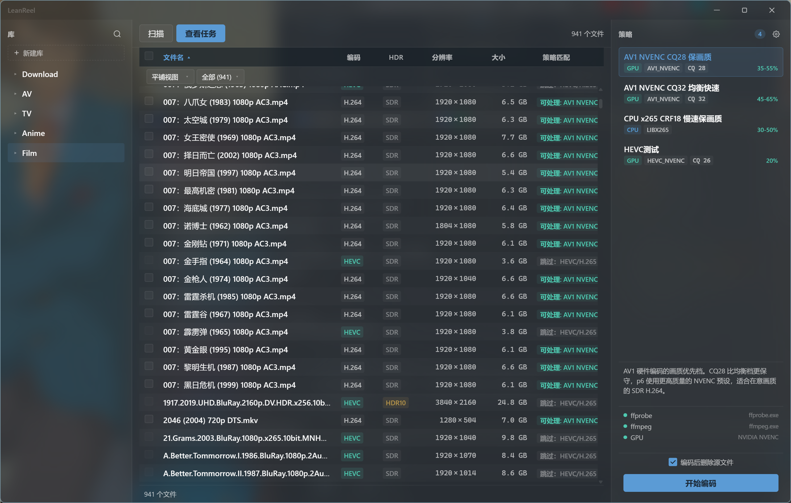

# LeanReel

<div align="center">

[](LICENSE)
[](https://github.com/jazz-zzzz/LeanReel/releases)
[](https://github.com/jazz-zzzz/LeanReel/releases/latest)
[](https://www.rust-lang.org/)
[](https://v2.tauri.app/)

</div>

桌面视频批量压缩工具。利用 GPU 硬件编码将 H.264/HEVC 视频转码为 AV1 或 HEVC，大幅缩减存储体积，同时保留画质。

**实测数据**：1,747 个文件，2.4 TB → 973.9 GB，平均节省 59%。

<p align="center">
  
</p>

## 安装

从 [Releases](https://github.com/jazz-zzzz/LeanReel/releases) 下载 `leanreel-rs_*.exe` 安装包（~3 MB），双击安装。

**系统要求**

- Windows 10/11 x64
- 自备 [FFmpeg](https://www.gyan.dev/ffmpeg/builds/)（首次启动在设置面板配置路径）
- GPU 编码需 NVIDIA RTX 系列显卡。CPU 编码（libx265）无此要求

单个 exe，无 Node.js、Python、.NET 运行时依赖。SQLite 和 WebView 静态编译进二进制。

## 功能

- **GPU 硬件编码** — AV1 / HEVC / H.264 NVENC 三选一，RTX 40 系列 AV1 速度 8-15× 实时
- **16 线程并行** — 自动区分 CPU/GPU 编码，CPU 任务不受限制，GPU 任务通过通道信号量排队
- **智能 GPU 限流** — NVIDIA 消费级显卡硬限制 3 个并发 NVENC 会话，工具自动排队避免驱动报错
- **内置策略** — AV1 CQ28 保画质、AV1 CQ32 均衡快速、x265 CRF18 慢速高质量，支持自定义编码参数
- **实时进度** — 多任务轮播展示文件名和进度，显示整体完成百分比
- **性能采样** — 每任务采集编码 FPS、平均码率、进程级 I/O 读写速率（`GetProcessIoCounters`），自动区分本地/SMB/混合存储拓扑
- **原子写入** — 临时文件编码完成后 `rename` 到目标路径，崩溃不丢源文件
- **超大保护** — 输出大于源文件自动丢弃输出
- **完整追溯** — 所有历史记录可查，含完整 FFmpeg 命令行、编码参数、性能数据

## 使用

1. **新建库** → 左侧面板创建库，添加一个或多个视频目录
2. **扫描目录** → ffprobe 自动探测编码格式、HDR 类型、音轨/字幕信息
3. **选择文件** → 表格中勾选目标文件（支持 Ctrl/Shift 批量操作），支持按编码/大小/策略匹配过滤
4. **选择策略** → 右侧面板点选预设策略，或自定义编码器、CQ/CRF、Preset 参数
5. **开始编码** → 可选"编码后删除源文件"
6. **查看结果** → 顶部「查看任务」面板展示历史记录、累计节省空间、逐任务性能指标

## 策略

| 策略 | 编码器 | CQ/CRF | Preset | 适用场景 |
|------|--------|--------|--------|----------|
| AV1 CQ28 保画质 | `av1_nvenc` | CQ 28 | p6 | 高画质，适合蓝光电影、动画 BD 源 |
| AV1 CQ32 均衡快速 | `av1_nvenc` | CQ 32 | p5 | 批量处理，体积优先，日用首选 |
| x265 CRF18 慢速 | `libx265` | CRF 18 | slow | CPU 编码，无 NVIDIA 显卡时使用 |

自定义策略支持指定编码器、CQ/CRF、Preset、音频/字幕处理模式。

> AV1 对高码率源（蓝光原盘、大体积 H.264）效果极佳；对已压缩到极限的低码率文件（动画 TV 源 < 2 Mbps）可能膨胀。工具自动丢弃输出大于源的结果。

## 技术架构

```
前端 (Svelte 5)                   后端 (Rust)
──────────────                    ────────────
invoke('scan')    ──IPC──→   #[tauri::command] fn scan()
invoke('encode')  ──IPC──→   #[tauri::command] fn start_encode()
emit('progress')  ←──事件──   Worker::emit_progress()

         │                              │
         └──── Tauri IPC 桥 ────────────┘
```

**架构层级**（单向依赖）：Commands → Services → Infrastructure → Domain

- **Commands**：Tauri 命令入口，接收前端调用，返回结果或触发事件
- **Services**：Worker 线程池（16 线程）、策略匹配器、编码流水线
- **Infrastructure**：FFmpeg/FFprobe 子进程管理、SQLite 持久化、Windows 进程 I/O 采样
- **Domain**：类型定义（`Strategy`、`EncodeOutput`、`IoMetrics`）与 trait 接口

**编码流水线**：Prepare（创建输出目录）→ Transcode（spawn ffmpeg）→ MoveOut（原子 rename）。三阶段固定，失败自动清理临时文件。

**GPU 并发控制**：

```
16 线程池
  ├─ CPU (libx265) ────────────→ 绕过信号量，直接执行
  └─ GPU (NVENC) ──→ 取令牌 ──→ 编码 ──→ 还令牌（Drop RAII）
                      ↑ 最多 3 个并发（MPSc channel 预填 3 令牌）
```

`mpsc::channel` 天然 FIFO 保证公平排队，`GpuToken` 在 Drop 时自动归还令牌，异常安全。

**I/O 优化**：

- `-pkt_size 8MB` 覆盖 FFmpeg file 协议默认 32 KB 缓冲，NAS 场景大幅减少 ReadFile 次数
- Windows SMB 带宽节流关闭（`EnableBandwidthThrottling=false`），避免系统主动限速
- 进程级 I/O 采样通过 `GetProcessIoCounters` 直接读取子进程计数器，替代共享级 `typeperf` 方案，实现逐任务隔离

## 从源码构建

```powershell
# 依赖: Rust 工具链 + pnpm
pnpm install
pnpm tauri build     # 产物在 src-tauri/target/release/bundle/
```

## FAQ

**AV1 编码为什么有些文件反而变大？**

低码率 H.264 源（< 2 Mbps）已接近压缩极限，AV1 在 CQ28 质量级下将编码噪声当作细节保留，反向膨胀。工具自动丢弃输出大于源的结果。详见 [#34](https://github.com/jazz-zzzz/LeanReel/issues) 审计数据。

**为什么限制 3 个并发 GPU 编码？**

NVIDIA 消费级 GPU 驱动硬限制 3 个并发 NVENC 会话，无法通过软件绕过。CPU 编码（libx265）不受此限，16 线程可以全速并行。

**支持 Mac/Linux 吗？**

目前仅 Windows。Tauri 2 框架跨平台，但 `GetProcessIoCounters` 和 SMB 调优依赖 Windows API。欢迎 PR 适配。

## 贡献

欢迎提交 Issue 或 PR。新功能或重大改动建议先开 Issue 讨论方案。

本地开发：`pnpm tauri dev`，需要本地安装 FFmpeg 并在设置面板配置路径。

## 致谢

- [Tauri](https://v2.tauri.app/) — 轻量级桌面应用框架
- [FFmpeg](https://ffmpeg.org/) — 音视频处理引擎
- [Svelte](https://svelte.dev/) — 响应式 UI 框架
- [rusqlite](https://github.com/rusqlite/rusqlite) — Rust SQLite 绑定

## 许可

MIT © 2026
