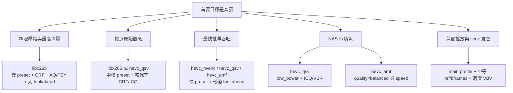
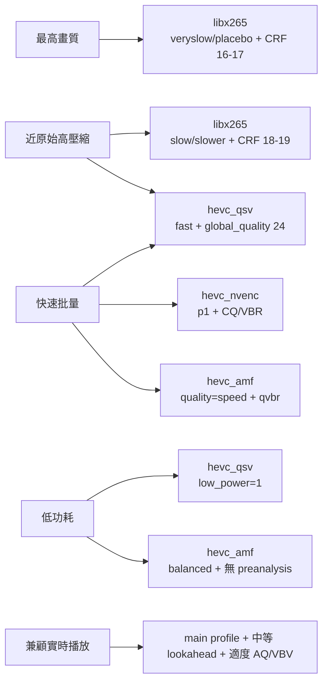

# NAS x264 片源轉碼至 HEVC 參數研究報告

## 執行摘要

在 FFmpeg 的 HEVC 路線之中，**CPU 端「x265」實際上就是 `libx265` 包裝器**；FFmpeg 直接暴露 `b`、`g`、`keyint_min`、`refs`、`preset`、`tune`、`profile`、`crf`、`qp` 等常用旋鈕，而更完整的 x265 參數面則經由 `x265-params` 透傳。就**可調參數深度、壓縮效率上限、對畫質細節的精細控制**而言，`libx265` 仍然是最完整的 HEVC 方案；若把目標設為「同等主觀質量下盡量縮細體積」，CPU x265 仍是參數自由度最高的一條路。citeturn3view0turn27view0turn32view0turn34view0

GPU 路線則分成三種主要參數哲學。`hevc_nvenc` 以 **preset / tune / rc / cq / rc-lookahead / AQ 類參數**主導速度與質量；`hevc_amf` 以 **usage / quality / rc / qvbr_quality_level / preanalysis / vbaq / lookahead** 為中心；`hevc_qsv` 則由 **preset / global_quality / look_ahead / extbrc / mbbrc / low_power** 主導。這三者都能顯著提升吞吐，但其參數面比 x265 更「策略式」而非「分析式」：即更偏向選擇一組硬件策略，而不是逐項微調分析深度。citeturn10view0turn25view0turn6view0turn7view0turn22view1

就參數影響來看，**第一層決策**通常是 `preset`／`quality`／`low_power` 這類「總體速度-品質」旋鈕；**第二層決策**是 `crf` / `global_quality` / `qvbr_quality_level` / `cq` / `bitrate` 這類率控旋鈕；**第三層決策**則是 `aq`、`lookahead`、`bframes`、`ref`、`me`、`subme`、`keyint`、`scenecut`、`vbv` 這些決定畫質細節、體積波動、延遲與兼容性的結構性參數。對 NAS 場景而言，若優先次序是「**最大壓縮**」，應偏向 `libx265`; 若是「**最快批量**」，則優先看 `hevc_nvenc` 的 `p1–p4`、`hevc_qsv` 的 `fast/medium + global_quality`、或 `hevc_amf` 的 `quality=speed/balanced + qvbr`；若是「**低功耗**」，`hevc_qsv` 的 `low_power` 是最直接、最明確的官方功耗旋鈕。citeturn32view0turn29view3turn30view0turn12view1turn12view2turn25view0turn6view0

本報告只討論**參數、比較關係、預期影響與場景矩陣**。由於**目標解析度、片源 bit depth、色度取樣、膠片顆粒保留需求、最終播放設備與可接受轉碼時長均為「未指定」**，以下所有「質量／速度／壓縮率／兼容性」均以**相對評估**表示，而不是絕對數值承諾。

## 假設與評估框架

本報告的未指定條件如下：**目標解析度＝未指定**、**原始片源 bit depth＝未指定**、**色度取樣＝未指定**、**顆粒保留需求＝未指定**、**播放端解碼能力＝未指定**、**單檔可接受轉碼時間＝未指定**。因此，下文中的「兼容性」一律解作**標準遵循與解碼友善度**，主要受 `profile`、`level`、`ref`、`bframes`、`vbv`、GOP 長度與是否使用 10-bit 等因素影響，而**不是**對某一指定電視、機頂盒或播放器的兼容保證。x265 官方文件亦明確指出，`profile` / `level-idc` / `high-tier` 會限制輸出規格，而過高 `ref` 甚至會令串流變為 non-conformant。citeturn34view0

本文使用四個可比較指標來評估參數組合：**相對畫質**、**相對速度**、**同等主觀畫質下的壓縮率**、**兼容性**。成功標準是：完整覆蓋 `libx265 / x265(CPU)`、`hevc_nvenc`、`hevc_amf`、`hevc_qsv` 的核心參數面；逐項梳理 x265 常用旋鈕；把 `gpu`、`device`、`cuvid/decoders`、`hwaccel`、`hwaccel_output_format` 的 FFmpeg 映射講清楚；並提供不少於五個場景、每個場景三組以上的具體參數包。這些場景組合屬**基於官方選項語義的推論性參數包**，用途是建立可比較的「調參輪廓」，不是官方唯一推薦值。citeturn3view0turn10view0turn22view1turn6view0

## FFmpeg 編碼器與核心參數對照

FFmpeg 在本題相關的 HEVC 路線，可分為一條 CPU 主線與三條主流 GPU 主線。`libx265` 是 x265 的 FFmpeg wrapper；`hevc_nvenc` 來自 NVIDIA NVENC；`hevc_amf` 來自 AMD AMF；`hevc_qsv` 則屬 Intel Quick Sync Video。這些編碼器的共同點是都能輸出 HEVC；但它們在率控語言、裝置選擇、畫質微調深度、以及功耗/延遲優先級上明顯不同。citeturn3view0turn10view0turn22view0turn5view2turn7view0

| 編碼器 | 性質 | 主要質量/率控參數族 | 主要結構/兼容性參數族 | 主要硬件/裝置參數族 | 參數面特徵 |
|---|---|---|---|---|---|
| `libx265` / x265(CPU) | CPU 軟編；FFmpeg 中實際入口是 `libx265` | `crf`、`bitrate`、`qp`、`vbv-maxrate`、`vbv-bufsize`、`aq-mode`、`aq-strength`、`psy-rd`、`psy-rdoq` | `profile`、`level-idc`、`ref`、`bframes`、`keyint`、`min-keyint`、`scenecut` | 無專屬 GPU 旋鈕 | 最完整；幾乎所有細節可透過 `x265-params` 深入調 |
| `hevc_nvenc` | NVIDIA 硬編 | `rc`、`cq`、`cbr/vbr`、`rc-lookahead`、`temporal_aq` | `preset`、`tune`、`profile`、B 參考模式、GOP 類參數 | `gpu`、CUDA/NVDEC 路徑、`hwaccel`、`hwaccel_output_format` | 以 preset/tune 為主軸，吞吐高，微調深度低於 x265 |
| `hevc_amf` | AMD 硬編 | `rc`=`cqp/cbr/vbr_peak/vbr_latency/qvbr/hqvbr/hqcbr`、`qvbr_quality_level`、`preencode`、`vbaq`、`preanalysis` | `usage`、`quality`、`profile`、`profile_tier`、`g`、`gops_per_idr`、`frame_skipping` | DX9/DX11/AMF surfaces、裝置初始化 | 參數多而偏策略化，尤其強調 preanalysis/lookahead/AQ |
| `hevc_qsv` | Intel 硬編 | `global_quality`、`look_ahead`、`look_ahead_depth`、`extbrc`、`mbbrc`、`bit_rate`、`rc_max_rate`、`rc_buffer_size` | `preset`、`profile`、`tier`、`gpb`、`gop_size`、`low_delay_brc`、`scenario` | `low_power`、QSV device/child device、`hwaccel qsv` | 以 ICQ/LA_ICQ/VBR 與 low_power 為特色，特別適合低功耗與零拷貝路線 |

資料整理自 FFmpeg `libx265`、QSV 官方文件、NVIDIA Video Codec SDK 官方文件，以及 AMD AMF 官方 Wiki。citeturn3view0turn10view0turn13search6turn22view0turn6view0turn7view0

有兩點特別重要。第一，**FFmpeg 並沒有獨立名為「x265」的輸出編碼器**；在 FFmpeg 中，CPU x265 路線就是 `libx265` wrapper，文中的「x265（CPU）」可理解為「`libx265` + `x265-params` 所代表的整個 x265 參數面」。第二，硬編器的「總速率-品質」大旋鈕效果都很明顯：x265 的 `preset` 從 `ultrafast` 到 `placebo`，AMF 的 `quality` 有 `speed / balanced / quality`，QSV 的 `preset` 由 `veryfast` 至 `veryslow`，而 NVENC 在官方性能表中也顯示，HEVC 於 1080p 8-bit 測試內容下，Ada 架構由 `P1 + VBR + HQ` 到 `P7 + VBR + HQ`，吞吐可由四位數 fps 下探至不足兩百 fps，說明 preset 本身就是一等大旋鈕。citeturn32view0turn25view0turn6view0turn12view1turn12view2turn12view3

## x265 參數對畫質、速度、體積的影響

x265 參數的調整邏輯，大致可分成四層：**總體速度層**（`preset`）、**率控層**（`crf` / `bitrate` / `qp` / `vbv`）、**結構層**（`ref` / `bframes` / `keyint` / `scenecut`），以及**視覺優化層**（`aq` / `psy` / `me` / `subme` / `rc-lookahead`）。其中 `preset` 決定一大批默認分析深度與演算法選擇；`tune` 會在 preset 之後再覆寫一組針對特定內容的偏向；`profile` / `level-idc` 則主要用來約束輸出以提升可解碼性。citeturn32view0turn34view0turn27view0

| 參數 | 官方語義 | 取值提高或變嚴的主要效果 | 對畫質 | 對速度 | 對體積 | 兼容性影響 |
|---|---|---|---|---|---|---|
| `preset` | 以預設組合交換壓縮效率與速度 | 愈慢通常分析更深、壓縮更高 | ↑ | ↓↓↓ | ↓ | 一般中性 |
| `crf` | 固定質量變碼率 | 數值愈高，量化愈重 | ↓ | 約中性 | ↓↓↓ | 中性 |
| `bitrate` | ABR 目標碼率 | 目標碼率愈高，平均可用 bits 愈多 | ↑ | 約中性 | ↑ | 常利於受限傳輸 |
| `qp` | 固定量化 | 數值愈高，量化愈重 | ↓ | ↑（相對） | ↓ | 中性 |
| `vbv-maxrate` / `vbv-bufsize` | 限制局部碼率與 buffer | 約束愈緊，波峰更受控，但高壓場景可能模糊化 | ↓/↔ | ↓ | ↑/↔ | ↑ |
| `profile` | 約束可解碼 profile | 由 `main` 到 `main10` 等受輸入與位深限制 | ↔/視內容 | ↔ | ↔/微降 | 影響最大之一 |
| `ref` | L0 參考幀上限 | 一般利壓縮，但線性增加 motion search 工作量；過高可觸發 non-conformance | ↑ | ↓↓ | ↓ | 過高會下降 |
| `bframes` | 連續 B 幀上限 | 提升壓縮，但增加 lookahead/記憶體/延遲 | ↑ | ↓ | ↓ | 實時/低延遲較差 |
| `keyint` | 最大 GOP 長度 | 更長 GOP 一般更省碼率，但 seek 與切段友善度下降 | ↔/↑ | ↔ | ↓ | 長 GOP 較保守性差 |
| `min-keyint` | 最小 GOP 長度 | 提高值會減少過密 keyframe | ↔/視內容 | ↔ | ↓ | 影響 seek/場景切換 |
| `scenecut` | I-frame 插入積極度 | 愈高愈積極插入 I-frame | 視內容；場景變換常 ↑ | ↓（輕微） | ↑/↔ | 可提升 seek 友善度 |

資料整理自 x265 官方 CLI 文件對 `preset`、`tune`、`profile`、`ref`、`keyint`、`min-keyint`、`scenecut`、`bitrate`、`crf`、`vbv` 與 `qp` 的定義。citeturn32view0turn34view0turn30view2turn29view3turn29view4

| 參數 | 官方語義 | 取值提高或啟用的主要效果 | 對畫質 | 對速度 | 對體積 | 補充判讀 |
|---|---|---|---|---|---|---|
| `psy-rd` | 偏向保留源畫面能量，而非單純 RD 最優 | 小幅提高可增主觀細節；過高會引入伪影並推高碼率 | 主觀 ↑ | ↓ | ↑/↔ | 低碼率下宜保守 |
| `psy-rdoq` | 量化階段偏向高能量重建 | 常利高頻細節保留，但客觀分數可下降 | 主觀 ↑ | ↓ | ↑/↔ | 高值風險比 `psy-rd` 更大 |
| `aq-mode` | 自適應量化模式 | 由關閉到 variance/dark-scene/edge-aware，通常改善平坦區與暗場分配 | ↑ | 小幅 ↓ | ↓/↔ | 暗場/低碼率尤其重要 |
| `aq-strength` | AQ 偏移強度 | 強度高更偏向區塊間重新分配 bits | 視內容；常 ↑ | 小幅 ↓ | 可能波動 | 過高時碼率更難預測 |
| `me` | 動態搜尋法 | `dia < hex < umh < star < sea/full`，愈高愈重 | ↑ | ↓↓↓ | ↓ | `full` 非常慢 |
| `subme` | 子像素細化級別 | 愈高分析更深 | ↑ | ↓↓ | ↓ | 與慢 preset 協同 |
| `merange` | 動態搜尋範圍 | 搜尋更遠運動，代價是速度 | 視內容；高運動時 ↑ | ↓ | ↓/↔ | 運動小內容回報有限 |
| `rc-lookahead` | 片型/率控前視窗 | 更利於 scenecut、B-frame、cuTree/AQ 決策 | ↑ | ↓ | ↓ | 同時增加延遲 |
| `no-psnr` / `no-ssim` | 不計算度量匯報 | 不直接改變碼流策略，只減少度量/日誌開銷 | 畫質不變 | 小幅 ↑ | 體積不變 | 屬監測參數，不是編碼質量旋鈕 |
| `tune=grain` | 膠片顆粒調校 | 啟用維持顆粒穩定的率控偏向，減少 grain pulsing | 顆粒主觀 ↑ | ↓ | ↑ | 若片源顆粒需求「未指定」，不應預設開啟 |
| `tune=psnr/ssim` | 為客觀指標優化 | 提升相應客觀分數，但未必最接近主觀觀感 | 客觀分數 ↑ | 視情況 | 視情況 | 非一般觀影最優先 |

資料整理自 x265 官方 CLI 文件對 `psy-rd`、`psy-rdoq`、`aq-mode`、`aq-strength`、`me`、`subme`、`merange`、`rc-lookahead`、`psnr/ssim` 及 `tune grain` 的說明。citeturn30view1turn30view2turn30view0turn29view0turn29view3turn31view1turn31view4turn31view5turn33view2

對 NAS 轉碼最實用的 x265 結論可以壓縮成一句：**先定 `preset`，再定 `crf`／`vbv`，然後才微調 `aq`、`psy`、`ref`、`bframes`、`rc-lookahead`**。原因是 `preset` 決定了大部分分析深度；`crf` 或 `vbv` 決定了最終體積輪廓；而 `aq` / `psy` / `lookahead` 更多是「在既定體積或既定速度框架下，把 bits 分配得更像你想要的樣子」。x265 亦明確指出，VBV 啟用後會帶來 emergency denoising，極端受壓時會以模糊換取 buffer 合規，因此**兼容/串流導向**與**純歸檔導向**的參數輪廓不宜完全相同。citeturn32view0turn29view3turn30view0

## GPU 與硬件加速參數映射

FFmpeg 的硬件加速參數，實際上分成三層：**解碼層**（`hwaccel`、顯式硬解 decoder）、**硬件表面格式層**（`hwaccel_output_format`）、以及**裝置選擇層**（`gpu`、`device`、`init_hw_device`、`hwaccel_device`）。不同廠商的映射方式並不相同：NVIDIA 習慣以 CUDA/NVDEC/NVENC 表面與 `gpu` 索引處理；AMD 以 DX9/DX11/AMF surfaces 或 AMF 原生表面處理；QSV 則更強調先建立/導出對應子裝置，再走零拷貝編碼。citeturn35view0turn36view0turn10view0turn23view3

| 參數 | 在 FFmpeg 中的主要映射位置 | NVIDIA 路線 | AMD 路線 | Intel QSV 路線 | 主要預期影響 |
|---|---|---|---|---|---|
| `gpu` | 編碼器私有選項 / CUDA 裝置索引 | `hevc_nvenc` 可直接以 `gpu` 選 NVENC capable GPU；也可透過 CUDA device 初始化選擇 | 非主要語言 | 非主要語言 | 多 GPU 系統中選卡；不直接改畫質 |
| `device` | `init_hw_device` / `hwaccel_device` / 子裝置 | CUDA device 以索引選擇；`hwaccel_device` 可指向既有硬件裝置 | AMD 官方示例以 `d3d11va` 初始化並導出 `amf` 裝置，Windows 多卡尤為常見 | QSV 以 `child_device` / `child_device_type` 綁定 DRM render node 或 DirectX adapter | 多 GPU / iGPU+dGPU 導向正確裝置 |
| `cuvid/decoders` | 顯式選擇硬解 decoder | 官方 FFmpeg 文檔示例可見 `av1_cuvid`；NVIDIA 文檔亦提到 cuvid decoder 內建 resize/crop 路徑 | 不適用 | 不適用 | 強制走 NVDEC/CUDA 解碼路線 |
| `hwaccel` | 解碼層 per-stream 參數 | 典型值為 `cuda`；官方指出可把解碼幀保留於 GPU 記憶體供轉碼 | 典型值為 `dxva2`、`d3d11va`、或 `amf` | `qsv` 與其他值不同，官方明言它重點是**加速轉碼零拷貝**，不是單純啟用解碼 | 決定是否走硬解與零拷貝路線 |
| `hwaccel_output_format` | 硬件表面格式選擇 | 典型值 `cuda`，目的是讓幀保持在 CUDA 表面 | DX9 常見 `dxva2_vld`，DX11 常見 `d3d11`，AMF 原生路線可用 `amf` | 官方文字對 QSV 更強調 `hwaccel qsv` 與裝置導出，而不是把 `qsv` 當作主要格式名用例 | 決定是否避免 GPU↔系統記憶體回拷 |
| `low_power` | QSV 編碼器私有選項 | 無對等官方單一旋鈕 | 無對等官方單一旋鈕 | 官方明示開啟後可降低功耗與 GPU 使用量 | 低功耗/NAS 場景關鍵 |

資料整理自 FFmpeg 核心文檔、NVIDIA 官方 FFmpeg 指南、AMD AMF 官方 HW Acceleration 指南，以及 FFmpeg QSV 文檔。citeturn35view0turn35view2turn36view0turn10view0turn23view0turn23view3turn39view0turn5view2

有三點值得單獨指出。其一，**`-hwaccel qsv` 的語義與 `cuda` / `d3d11va` 不同**：FFmpeg 官方說明它主要對應 QSV 的 accelerated transcoding 與零拷貝，而不是單獨「開啟硬解」。其二，NVIDIA 官方文件把 `hwaccel cuda + hwaccel_output_format cuda` 描述為把視頻幀保留在 GPU 記憶體的常見方法；這就是 NVDEC → NVENC 零拷貝管線的參數核心。其三，AMD 官方文件則明確指出，`hwaccel_output_format d3d11` / `dxva2_vld` 可以避免 raw data 在 GPU 與系統記憶體之間來回複製，而 `hwaccel_output_format amf` 則只在輸出仍由 AMF-aware 組件消費時真正有意義。citeturn35view0turn10view0turn23view3

## 場景矩陣與決策圖

下列決策圖與場景組合，屬**依官方參數語義整理出的推論性參數輪廓**。它們的用途是把複雜參數面收斂成幾種穩定風格：重壓縮、近原質、高吞吐、低功耗、兼顧播放。若片源有重顆粒、動漫線條、高動作噪訊、或輸出需嚴格匹配某播放盒規格，最終數值仍應在這些輪廓上微調。citeturn32view0turn30view2turn22view1turn10view0turn25view0turn6view0

此圖綜合 x265、QSV、AMF、NVENC 官方參數語義而成：x265 側重 `preset`、`CRF`、`AQ/PSY` 與 GOP/引用結構；QSV 側重 `global_quality`、`look_ahead`、`low_power`；AMF 側重 `usage/quality/rc/preanalysis`；NVENC 則以 `preset/tune/rc/cq/lookahead` 為主。citeturn32view0turn30view0turn30view2turn6view0turn7view0turn25view0turn10view0

| 場景 | 組合 | 編碼器 | 參數組合 | 相對質量 | 相對速度 | 相對壓縮率 | 兼容性 | 預期效果 |
|---|---|---|---|---|---|---|---|---|
| 最高畫質 | A | `libx265` | `preset=veryslow; crf=16; profile=main10; aq-mode=3; aq-strength=0.8; psy-rd=2.0; psy-rdoq=1.0; bframes=8; ref=5; me=star; subme=5; keyint=240; min-keyint=24; scenecut=40; merange=57; rc-lookahead=40` | 極高 | 極慢 | 極高 | 中 | 最像「歸檔壓縮」輪廓；體積通常顯著下降，但時間成本高 |
| 最高畫質 | B | `libx265` | `preset=placebo; crf=17; profile=main10; aq-mode=2; aq-strength=0.7; psy-rd=1.5; psy-rdoq=1.0; bframes=8; ref=6; me=full; subme=7; keyint=250; min-keyint=25; scenecut=40; rc-lookahead=60` | 極高 | 極慢以下 | 極高 | 中低 | 只在極端追求分析深度時才有意義；邊際收益通常最小 |
| 最高畫質 | C | `hevc_nvenc` | `preset=p7; tune=hq; rc=vbr; cq=19; rc-lookahead=32; temporal_aq=1` | 高 | 快 | 中高 | 中 | GPU 上限型高畫質方案；吞吐遠高於 CPU，但壓縮效率通常仍低於慢速 x265 |
| 接近原始質量的高壓縮 | A | `libx265` | `preset=slow; crf=18; profile=main10; tune=none; aq-mode=3; aq-strength=0.9; psy-rd=2.0; psy-rdoq=1.0; bframes=6; ref=4; me=umh; subme=4; keyint=240; min-keyint=24; scenecut=40; rc-lookahead=30` | 很高 | 慢 | 很高 | 中 | 最平衡的「近原質高壓縮」常用型 |
| 接近原始質量的高壓縮 | B | `libx265` | `preset=slower; crf=19; profile=main10; tune=grain（僅顆粒需求明確時）; aq-mode=2; aq-strength=0.8; psy-rd=1.5; psy-rdoq=1.0; bframes=6; ref=5; me=star; subme=5; keyint=240; min-keyint=24; scenecut=35; rc-lookahead=40` | 很高 | 很慢 | 很高 | 中 | 對顆粒/紋理內容更穩，但顆粒需求若「未指定」不宜預設採用 |
| 接近原始質量的高壓縮 | C | `hevc_qsv` | `preset=slow; global_quality=18; look_ahead=1; look_ahead_depth=40; extbrc=1; mbbrc=1; profile=main10` | 高 | 中快 | 中高 | 中 | 若必須用硬編又想靠近高壓縮路線，QSV 的 ICQ/LA_ICQ 輪廓通常比純速率模式更合理 |
| 快速批量轉碼 | A | `hevc_nvenc` | `preset=p1; tune=hq; rc=vbr; cq=23; rc-lookahead=0` | 中高 | 極快 | 中 | 中高 | 典型高吞吐批量路線；畫質足夠但不追求極致節省 |
| 快速批量轉碼 | B | `hevc_qsv` | `preset=fast; global_quality=24; look_ahead=0; extbrc=0; mbbrc=1; low_delay_brc=0` | 中高 | 很快 | 中 | 高 | 吞吐與功耗通常比 CPU 更友善，且參數語義相對簡潔 |
| 快速批量轉碼 | C | `hevc_amf` | `usage=transcoding; quality=speed; rc=qvbr; qvbr_quality_level=24; preencode=false; preanalysis=false; vbaq=false; frame_skipping=false` | 中 | 很快 | 中 | 中高 | AMD 批量向輪廓；關閉 preanalysis 後延遲與負載更可控 |
| NAS 低功耗優先 | A | `hevc_qsv` | `preset=medium; global_quality=24; low_power=1; look_ahead=0; extbrc=0; mbbrc=1; profile=main` | 中高 | 快 | 中 | 高 | 最典型低功耗/NAS 友善輪廓；官方直接提供 `low_power` 旋鈕 |
| NAS 低功耗優先 | B | `hevc_qsv` | `preset=fast; global_quality=26; low_power=1; look_ahead=0; low_delay_brc=1; profile=main` | 中 | 很快 | 中低 | 高 | 若首要是節能與吞吐，而非極限體積，這組更穩妥 |
| NAS 低功耗優先 | C | `hevc_amf` | `usage=transcoding; quality=balanced; rc=vbr_peak; preencode=false; preanalysis=false; vbaq=false; frame_skipping=false` | 中 | 快 | 中 | 中高 | AMD 平衡型低負載輪廓；在不開 preanalysis/lookahead 下較省資源 |
| 兼顧實時播放 | A | `hevc_nvenc` | `preset=p4; tune=hq; rc=vbr; cq=22; rc-lookahead=16; temporal_aq=1` | 中高 | 很快 | 中 | 高 | 兼顧吞吐與播放友善度，適合作為「不太難播」的中庸 GPU 路線 |
| 兼顧實時播放 | B | `hevc_qsv` | `preset=medium; global_quality=23; profile=main; look_ahead=1; look_ahead_depth=20; low_delay_brc=1; extbrc=1` | 中高 | 快 | 中 | 高 | 播放/seek/功耗三者之間較平衡 |
| 兼顧實時播放 | C | `hevc_amf` | `usage=transcoding; quality=balanced; rc=hqvbr; qvbr_quality_level=22; vbaq=true; preanalysis=true; pa_lookahead_buffer_depth=16` | 中高 | 中快 | 中 | 中高 | 若希望較好的主觀觀感與仍可接受的即時性，這是 AMD 較合理的折衷組 |

上表中的參數組合為**推論性方案**：所用參數名、取值範圍與方向性，均來自官方文件；而「哪幾個值被放在同一組」則是為了建立可比較的實務輪廓。對於 x265，`preset`、`crf`、`aq`、`psy`、`ref`、`bframes`、`me`、`subme`、`keyint`、`scenecut`、`rc-lookahead` 的含義與趨勢由官方 CLI 文件直接支持；對於 QSV，`preset`、`global_quality`、`look_ahead`、`extbrc`、`mbbrc`、`low_power` 與 `profile` 由 FFmpeg 官方 QSV 文件支持；對於 AMF，`quality`、`rc`、`qvbr_quality_level`、`preanalysis`、`pa_lookahead_buffer_depth`、`vbaq` 與 `usage` 由 AMD AMF 官方 Wiki 支持；對於 NVENC，`preset`/`tune`/`rc`/`lookahead`/`CQ` 則由 NVIDIA Video Codec SDK 與 FFmpeg NVENC 源碼/文檔共同支持。citeturn32view0turn30view0turn30view2turn34view0turn33view2turn6view0turn7view0turn25view0turn24view4turn22view1turn10view0turn17view1turn17view4turn20view4turn19view0turn12view2

這張圖把五個場景對應到最應優先考慮的參數家族：`libx265` 用於「壓縮率主導」，`hevc_nvenc` 用於「吞吐主導」，`hevc_qsv` 用於「低功耗/折衷」，`hevc_amf` 則介乎批量與平衡之間。citeturn32view0turn10view0turn25view0turn6view0turn22view1

## 信心評估與主要不確定因素

**信心分數：0.84**

主要不確定因素有五個。第一，**片源特性未指定**：若原始內容是高噪訊膠片、重顆粒動畫、低光運動場景，`aq`、`psy`、`tune=grain`、`vbv` 的最佳點會明顯改變。第二，**目標播放設備未指定**：`main10`、較高 `ref`、長 GOP、較激進 B-frame 結構，雖然都可能提升壓縮效率，但會改變解碼要求與 seek 友善度；x265 官方也明言 `profile` / `level` / `ref` 受規格約束。第三，**硬件代際差異很大**：NVIDIA 官方性能資料顯示不同架構的 NVENC 吞吐差異明顯；AMD 官方亦說明某些轉碼/表面/解碼能力取決於 GPU 世代與驅動；Intel 官方 oneVPL 硬件能力表則直接指出 HEVC 的位深與色度支持隨硬件而變。第四，**FFmpeg build 差異**也會影響可見選項與可用硬件路徑；FFmpeg 官方本身亦提醒，實際 hwaccel 可用性依賴編譯與驅動。第五，**本報告刻意不包含命令樣例與實測流程**，因此所有場景組合都以官方語義 + 推論方式表達，而非對某一特定 NAS 平台的 benchmark 結果。citeturn34view0turn12view1turn12view2turn23view3turn26search2turn35view2

綜合而言，如果你的真正優先序是**最細體積**，應把主決策集中在 `libx265` 的 `preset`、`crf`、`aq`、`psy`、`ref`、`bframes` 與 `rc-lookahead`；如果優先序是**最快批量**，則把主決策集中在 `hevc_nvenc` 的 `preset/tune/cq`、`hevc_qsv` 的 `global_quality/preset`，或 `hevc_amf` 的 `quality/rc/qvbr_quality_level`；如果優先序是**低功耗 NAS**，`hevc_qsv low_power` 是最明確的官方關鍵旋鈕。這一結論在官方文件之間具有高度一致性。citeturn3view0turn32view0turn10view0turn25view0turn6view0